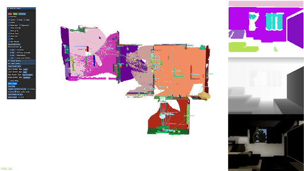

# SceneGraphFusion


This is a framework for generating incremental 3D scene graphs from data generated using the VirtualHome simulator.

This is based on [SceneGraphFusion c++ framework](https://github.com/ShunChengWu/SceneGraphFusion). For the network part of the code, check [here](https://github.com/ShunChengWu/3DSSG).

# Prerequisites
## git, cmake
```
apt update
apt install git
# cmake
sudo apt install python3-pip
pip3 install cmake
# create ssh key and associate to your account in order to clone this project.
# * Generate new ssh key [link](https://docs.github.com/en/github/authenticating-to-github/generating-a-new-ssh-key-and-adding-it-to-the-ssh-agent)
# * Adding a new ssh key to your account [link](https://docs.github.com/en/github/authenticating-to-github/adding-a-new-ssh-key-to-your-github-account)
```
# OpenCV, Eigen
```
# Eigen3 3.3.90  
# OpenCV 4.0.0  
# This project will try to install them locally if they were not found.
```
# Assimp
loading meshes for online rendered view generation. 
```
apt install libassimp-dev
```

# Optional dependencies
With GUI:
```
# OpenGL & Glfw3
apt install freeglut3-dev libglfw3-dev

```
With graph prediction:
```
# Onnxruntime
# See https://github.com/microsoft/onnxruntime for more information
git clone --recursive -b v1.8.2 https://github.com/microsoft/onnxruntime
cd onnxruntime
# For Linux
./build.sh --config RelWithDebInfo --build_shared_lib --parallel
cd build/Linux/RelWithDebInfo
sudo make install
```

#### BUILD
build the basic segmentation system 
```
git clone {this_repo}
cd SceneGraphFusion
git submodule init
git submodule update
mkdir build
cd build
cmake ..
make
```
build with GUI or graph prediction, pass these options in cmake:
```
cmake -DBUILD_GRAPHPRED=ON -DBUILD_GUI=ON ..
```

# Run
```
./exe_GraphSLAM --pth_in path/to/3RScan/squence/
# or with GUI
./exe_GraphSLAM_GUI --pth_in path/to/3RScan/squence/
# to see usage and options 
./exe_GraphSLAM --help
# to run with graph prediction (need to build with graph predict)
./exe_GraphSLAM_GUI --pth_in path/to/3RScan/squence/ --pth_model /path/to/the/traced/model/folder/
```

you can download the traced model of our pretrained network [here](https://drive.google.com/file/d/1_745ofaOUyP_iFK8A3cSW60L4V7TlWa7/view?usp=sharing). 
The model is trained with 20 NYUv2 object classes used in ScanNet benchmark, and with 8 support types of predicates. 


# License
[](https://opensource.org/licenses/BSD-2-Clause)

# Troubleshooting

In some platforms the CMake config for Assimp is called `assimpConfig.cmake` and
in others `AssimpConfig.cmake`. This mismatch can lead to CMake not finding the
library despite being available in the system. If this is the case, edit
`cmake/UseAssimp.cmake` to look like this:

```
find_package(assimp QUIET)
OPTION(WITH_ASSIMP "Build with Assimp support?" ${assimp_FOUND})

IF(WITH_ASSIMP)
    MESSAGE(STATUS "WITH Assimp")
    find_package(assimp REQUIRED)
    INCLUDE_DIRECTORIES(${assimp_INCLUDE_DIRS})
ENDIF()
```

See https://github.com/assimp/assimp/pull/3455,
https://github.com/microsoft/vcpkg/issues/14256 for more details
